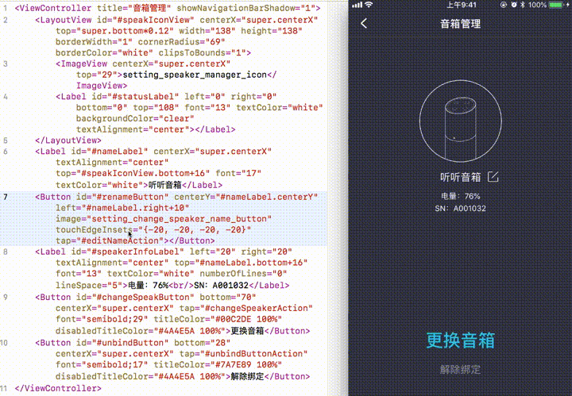

# GearUI

GearUI 2.0是一套面向iOS开发者**高效的**、**低学习成本的**编写UI布局框架。

它的工作方式：

1. 通过**XML**进行快速的**UI布局**处理
2. 通过**JSON数据**进行通用化的**数据**处理
3. 通过**JavaScript**或者**本地代码**进行**逻辑**处理

它能带来哪些好处：

1. 更少的代码，更高的效率
	- 表达式方式写约束。输入量较少80%
	- UI实时查看运行效果，无需编译运行。更快的对齐UI细节。
2. 更低的接入成本
	- 只有4K代码量，更快速方便的接入项目。安装包大小压力小。
	- 保持和系统SDK API一致，学习成本极低。
3. 极好的扩展性
	- 已集成大量常用实用功能。比如：响应区域扩展、键盘输入防遮挡、图形表达式等等
	- 极强的自定义扩展能力，更方便的复用。代码越写越快。

# 实时编写UI

无需编译，在本地修改UI布局后，可实时在真机和模拟器上查看效果！不再有任何等待。开发体验如下图，左侧编辑器和右面真机屏幕为同步录制。



实时预览使用请参考：
[https://github.com/shenqiliang/GearUI/wiki/%E5%AE%9E%E6%97%B6%E9%A2%84%E8%A7%88](https://github.com/shenqiliang/GearUI/wiki/%E5%AE%9E%E6%97%B6%E9%A2%84%E8%A7%88)

# 高效布局

使用XML编写方式快速设定视图层级结构、布局约束和属性。

* 毫无学习压力，所有视图和属性和系统完全一致
* 使用表达式直接写自动布局，更加高效写UI代码。

一个简易的ViewController：

	<ViewController title="Layout Demo" backgroundColor="#2D323F 100%">
		<LayoutView id="container" tap="1">
			<Label id="message" left="30" right="30" top="30" bottom="86" numberOfLines="0" font="24" textAlignment="center" textColor="white">提示文字</Label>
			<Button id="btn_left" left="48" bottom="72" height="30" titleColor="#00C2DE 100%" font="bold;24" touchEdgeInsets="{-20, -20, -20, -20}">取消</Button>
			<Button id="btn_right" right="48" bottom="72" height="30" titleColor="#00C2DE 100%" font="bold;24" touchEdgeInsets="{-20, -20, -20, -20}">确定</Button>
		</LayoutView>
	</ViewController>

`Label`、`Button`、`numberOfLines`、`textAlignment`是否很熟悉？GearUI完全支持原生视图组件，以及其所有属性，完全动态解析，免除自己扩展烦恼。

***注意：容器视图请使用`LayoutView`，`LayoutView`提供子视图布局支持。***

`left="30" right="30" top="30" bottom="86"`这段代码指定视图的布局左、右、上、下四个方向的边距。

可以指定相对布局/约束：
比如buttonB在buttonA右边10个像素，可以这么指定：

	<Button id="buttonA" .../>
	<Button id="buttonB" left="buttonA.right+10" .../>

或者更复杂一点，比如：buttonB的宽度是buttonA的宽度的2倍在加5个像素

	<Button id="buttonA" .../>
	<Button id="buttonB" width="buttonA.width*2+5" left="buttonA.right+10" .../>

从第一个例子可以看到可以看到`numberOfLines`、`textAlignment`这些属性是系统Label的，对，GearUI完全支持系统Label所有属性，不需要添加额外代码，框架会根据属性名称做动态解析。如果你在Label上扩展了一个属性，也是可以直接在XML中写的哦。

自定义的控件如果接入？很简单：

	<View class="CustomView" left="0" customProperty="value" .../>

其中`CustomView`是你的控件的类名，`customProperty`是你定义的控件的属性。如果你不想写`class`，也可以直接注册一个节点名：

	// GUConfigure
	- (void)registerNodeName:(NSString *)nodeName forClass:(Class)cls

如何视图修改数据？有两种方法：

1. 通过动态绑定获取视图对应的对像，然后直接修改其属性
2. 通过视图id和keypath

	[self.view setKeyPathAttributes:@{@"buttonA.title":"Button 1", buttonB.title":"Button 2"}];
	
> 此代码会在view的子孙view中找到id为`buttonA`的view，然后将`title`属性设置为`Button 1`，同时找到id为`buttonB`的view，然后将`title`属性设置为`Button 2`，


# 如何使用?

### 1. 下载代码

	git clone https://github.com/shenqiliang/GearUI.git

### 2. 安装类模版和代码提示

进入项目目录，执行以下脚本。

	./setup_tools.sh

完成后，Xcode中新建文件应该有`GearUI View Controller`和`GearUI View Controller OC`两个文件模版了。同时XML文件应该能自动完成一些常用的类和属性的补全功能。

### 3. 集成GearUI

有两种方式

#### 3.1 使用Cocospod集成

在项目Podfile增加如下代码：

	use_frameworks!
	
	target '你的项目Target' do
	    pod 'GearUI', :git => 'https://github.com/shenqiliang/GearUI.git'
	end

执行`pod install`

#### 3.2 源码集成

1. 将Sources/GearUI目录拖进工程即可

### 4. 开启后台调试服务

双击运行`tools`目录下的`GearUIDebugServer.app`，启动后即开启后台调试服务。

> 如果无法运行，可以自行编译app，此目录下有源码。
> 如果弹出权限弹窗，请允许访问


### 5. 在AppDelegate中开启实时预览调试

	[[GUConfig sharedInstance] enableRuntimeDebug]

> 这个代码将开启本地TCP端口监听xml变更通知，并与`GearUIDebugServer.app`建立通信通道。

### 6. 创建View/ViewController

在Xcode项目里选择`File`->`New`->`File...`，打开模版选择对话框，找到`GearUI View Controller`或者`GULayout View`这个模版，然后按提示创建View/ViewController，完成后会增加两个文件`XXXViewController.swift`/`XXXView.swift`和`XXXViewController.xml`/`XXXView.xml`。然后就可以写xml了。

***注意：如果你使用Objective-C语言开发，请使用`GearUI View Controller OC`这个模版***

### 7. 运行和实时预览

build & run之后，手机里操作跳转到相应GearUIViewController，然后修改xml代码保存，即可在手机上实时看到修改后的效果。

### 8. 可选配置

GearUI支持很多配置，可根据业务需求进行自定义。相关可配置能力在GUConfigure单例对象中。

```
@interface GUConfigure : NSObject

@property(class, nonatomic, readonly) GUConfigure *sharedInstance NS_SWIFT_NAME(shared); /// 单例

/// 开启实时调试模式。调用后启动监听。
- (BOOL)enableRuntimeDebug;

/// 判断是否开启了实时调试。
@property (nonatomic, assign, readonly) BOOL isEnableRuntimeDebug;

/// 图片加载代理。设置后可会使用代理方法下载网络图片。
@property (nonatomic, strong) id<GUImageLoadDelegate> imageLoadDelegate;

/// URL处理代理。设置后当GearUI打开一个URL时，会使用此代理回调。如果没有设置则使用UIApplication.openURL方法
@property (nonatomic, strong) id<GUURLHandleDelegate> URLHandleDelegate;

/// 日志打印代码。设置后，GearUI将调用此代理方法打印日志
@property (nonatomic, strong) id<GULogHandleDelegate> logHandleDelegate;

/// 本地补丁路径，如果设置，会优先从此路径中寻找布局文件
@property (nonatomic, strong) NSString *patchPath;

/// 设置节点的默认属性，可用于整体工程风格化
- (void)setDefaultAttributes:(NSDictionary *)attibutes forNodeName:(NSString *)nodeName;

/// 设置枚举名称字符串
- (void)setEnumeRepresentation:(NSDictionary<NSString *, NSNumber *> *)enumNameAndValues forPropertyName:(NSString *)property ofClass:(Class)cls;

/// 获取枚举名称字符串对应的枚举值
- (NSNumber *)enumValueForRepresentation:(NSString *)enumRepresentation forPropertyName:(NSString *)property ofClass:(Class)cls;

/// 注册一个新节点
- (void)registerNodeName:(NSString *)nodeName forClass:(Class)cls;

@end
```

#### 8.1 图片下载代理

GearUI控件（ImageView，Button）支持网络图片的展示，如需要进行网络图片显示，只需要配置一下图片下载代理即可。图片下载代理可设置为实现`GUImageLoadDelegate`协议的对象。

```
@protocol GUImageLoadDelegate <NSObject>

@required
/**
 载入网络图片代理，返回一个可取消对象，用来取消此url图片的下载操作。

 @param url 图片url
 @param completedBlock 图片载入完成时，回调图片或者错误对象
 @return 取消操作对象，必须实现cancel方法，用来取消此url的下载。
 */
- (id<GUImageLoadOperation>)loadImageFromURL:(NSURL *)url completed:(GUImageLoadCompletedBlock)completedBlock;

@end
```

推荐使用SDWebImage库，配置方法如下：

```
// SDWebImageCombinedOperation支持GUImageLoadOperation协议
extension SDWebImageCombinedOperation: GUImageLoadOperation {
}

// 创建delegate对象
class SDWebImageLoadDelegate: NSObject, GUImageLoadDelegate {
    func loadImage(from url: URL!, completed completedBlock: GUImageLoadCompletedBlock!) -> GUImageLoadOperation! {
        return SDWebImageManager.shared.loadImage(with: url, options: [.handleCookies, .continueInBackground, .retryFailed], context: nil, progress: nil) { (image, _, error, _, _, _) in
            completedBlock(error, image, false)
        }
    }
}

// 配置图片下载代理
GUConfigure.shared.imageLoadDelegate = SDWebImageLoadDelegate()
```


# 功能介绍

## 如何使用布局？

GearUI底层使用iOS自动布局（AutoLayout）进行布局。

布局必须发生在LayoutView里。`ScrollView`和`TableViewCell`容器节点会自动创建一个LayoutView。

布局采用`y="id.x*a+b"`这种表达式方式，其中`id`为相对布局的视图id，`x`、`y`为布局的属性，`a`、`b`为布局常量。比如：

	<Label id="label1" width="100">
	<Label id="label2" width="label1.width*0.5+30">
	
即表示label2的宽度为label1的一半再加上30个点。

目前支持的布局属性如下：

* left
* right
* top
* bottom
* width
* height
* centerX
* centerY
* baseLine

### 相对于父试图布局

可以使用super来代表父视图：

	<LayoutView>
		<ScrollView width="super.width*0.5" height="super.height"/>
		<ScrollView width="super.width*0.5" height="super.height"/>
	</LayoutView>
	
### 支持safeArea

	<View top="safeArea.top+10">

注意：GearUI的safeArea经过特殊处理，支持iOS11以下版本。iOS11以下版本，通过topLayoutGuide和bottomLayoutGuide自动计算。
	
## 如何绑定视图对象？

通过`id`属性值前面加上`#`符号后，当UI加载时会自动绑定到响应`View/ViewController`的同名属性上，请确保类型一致即可。


## 属性表示方法

### 颜色类型（UIColor）

* 带透明度颜色值(Sketch格式)：`#` + `6个16进制数` + `空格` + `透明度百分比`。大小写不限；如果是不透明，可省略透明度部分。比如：`#88ff00`、`#88ff00 50%`、`#f00 100%`
* RGBA：`8个16进制数`
* 常用颜色表示：`red`、`green`、`blue`、`yellow`...等等。和系统常用颜色保持一致，比如`red`对应`[UIFont redColor]`.

### 字体类型（UIFont）

字体类型可以用`字体名` + `;` + `字体大小`来表示，其中`字体名`如果是默认字体可以省略，直接用`字体大小`来表示。如果系统默认字体，只是粗细不同，字体名可以按粗细程度写成`bold`、`semibold`、`medium`和`light`等。粗细程度也可以用css字重表示，如`w400`、`w500`等。

	font="13"  // 13号默认字体
	font="bold;14" // 14号粗体
	font="PingFangSC-Medium;20" // 20号苹方Medium字体
	font="w500;20" // 500字重20号字体

### 图片类型（UIImage）

图片类型可以用以下表示方式：

* 图片名字（imageName）
* 纯颜色值（见[颜色类型](#颜色类型（UIColor）)）
* 形状表达式
	* 三角形
	* 圆形
	* 圆角矩形

比如：

```
image="logo"
image="red"
image="#ff0000 50%"
image="triangle(points:[{0,0},{0,100},{100,100}],fill:green,stroke:red,width:12)"
image="circle(radius:50,fillColor:#888800 50%)"
image="round(corner:20,fillColor:blue)"
```

## 图片视图（ImageView）

图片视图节点，可以通过一下方式设定图片显示的内容

* 图片名字（见[图片类型](#图片类型（UIImage）)）
* 本地路径
* URL
* 序列帧格式
* 纯色值（见[图片类型](#图片类型（UIImage）)）
* 形状表达式（见[图片类型](#图片类型（UIImage）)）

XML节点内容可以是`Image Name`或者`URL`，比如

	<ImageView>logo</ImageView>
	<ImageView>https://imgcache.qq.com/xxxx-xxx/icon.png</ImageView>


## 文本标签（Label）

GearUI中文本标签可以直接在xml中写入富文本，富文本格式类似HTML。

    <Label left="20" lineSpace="4" top="84" font="16" right="20" numberOfLines="0">
        <line >This is mutiline <red color="red">attributed</red> text.<br/></line>
        <line >The second line. <b>bold text</b> and <i>italic text.</i><br/></line>
        <line><font color="blue" font="22">The third line with font size <ll lineSpace="44" >22.</ll></font><br/></line>
        <line >The fourth auto wrap long long long long long long long long long long long line.<br/></line>
    </Label>
    
文本中支持可点击链接，直接自定义高亮色，高亮背景。

    The second line. <b tap="#click" highlightedColor="red" highlightedBackgroundColor="green">bold clickable text</b> and <i>italic text.</i>
    
    


## 通过KeyPath设置属性

当需要修改视图的属性时，处理动态绑定视图对象后直接修改外，也可以用KeyPath方式设置视图属性。

```
self.setKeyPathAttributes(["label1.text" : "我修改了label文本！"])
```

KeyPath可以使用`id`路径，对于布局：

```
<LayoutView id="firstLayout">
	<Label id="label1">label文本</Label>
</LayoutView>
<LayoutView id="secondLayout">
	<Label id="label1">label文本</Label>
</LayoutView>
```

有两个相同id的label，分别在不同父布局下，如果调用：

```
self.setKeyPathAttributes(["firstLayout.label1.text" : "我修改了label文本！"])
```

这时只会修改第一个label的文本。

## 常见扩展功能

### 扩展view的响应区域

使用touchEdgeInsets属性，可以对view的`{top,left,bottom,right}`的响应区域进行调整，负值为扩展，正值为收缩

	<View touchEdgeInsets="{0,-10,0,-10}">

### UIButton自定义图片和标题排列


# 更多功能介绍

* 精准出错提示
* 无缝绑定
* 代码自动完成
* 动画支持
* JavaScript脚本执行
* GBI/GBX存储格式
* 动态下发框架

